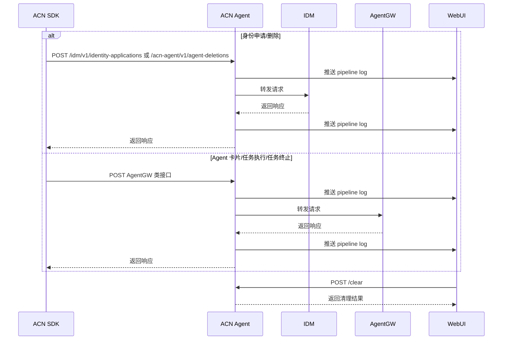

# ACN Agent

## 1. 项目结构
```text
acn_agent/
├── acn_agent/
│   ├── api/
│   │   └── routes.py
│   ├── core/
│   │   ├── config.py
│   │   └── logging.py
│   ├── models/
│   │   └── common.py
│   ├── services/
│   │   ├── agent_service.py
│   │   ├── http_forwarder.py
│   │   ├── metrics.py
│   │   ├── pipeline_logger.py
│   │   └── state_store.py
│   ├── tests/
│   │   └── test_agent_api.py
│   └── main.py
├── docs/
│   ├── api.md
│   ├── architecture.md
│   └── quick_start.md
├── mocks/
│   ├── acn_sdk_mock.py
│   ├── agent_gw_mock.py
│   ├── common.py
│   ├── idm_mock.py
│   └── webui_mock.py
├── scripts/
│   └── start_acn_agent.sh
├── message.txt
├── pyproject.toml
└── requirements.txt
```

## 2. 项目说明
本项目使用 Python + FastAPI 实现 ACN Agent 组件，负责承接 ACN SDK 请求并将消息转发到 IDM 或 AgentGW，同时处理 WebUI 的清理指令，并按需向 WebUI 推送 `/acn/v3/pipeline-logs` 流水日志。

## 3. 功能实现
- 监听 `9010` 端口，接收 ACN SDK 请求
- 根据接口路径转发消息到 IDM(`9020`) 或 AgentGW(`9001`)
- 原样返回上游响应给 ACN SDK
- 处理 WebUI 的 `/clear` 请求，清理本地记录与打点
- 关键消息收发、状态变化、转发结果全部通过 `logging` 记录
- 通过内存状态存储保存请求记录和流水日志，便于联调与扩展
- IDM、AgentGW、WebUI 的 IP 地址在代码中固定定义，默认使用本机 `127.0.0.1`

## 4. 主要时序


## 5. 启动方式
详见：
- [快速启动文档](/home/acn/cxr/acn_agent/docs/quick_start.md)
- [系统架构文档](/home/acn/cxr/acn_agent/docs/architecture.md)
- [接口 API 文档](/home/acn/cxr/acn_agent/docs/api.md)

Linux / Ubuntu 一键启动：
```bash
chmod +x scripts/start_acn_agent.sh
./scripts/start_acn_agent.sh
```

## 6. 测试说明
测试使用桩传输模拟 IDM、AgentGW、WebUI，不开发其他系统组件，覆盖：
- IDM 转发
- AgentGW 转发
- clear 清理
- 健康检查

执行命令：
```bash
pytest
```

## 7. Mock 组件
已提供以下模拟程序用于本地测试 ACN Agent：
- `mocks/idm_mock.py`
- `mocks/agent_gw_mock.py`
- `mocks/webui_mock.py`
- `mocks/acn_sdk_mock.py`

可直接用 `uvicorn` 或 `python -m` 启动这些 mock 程序。
