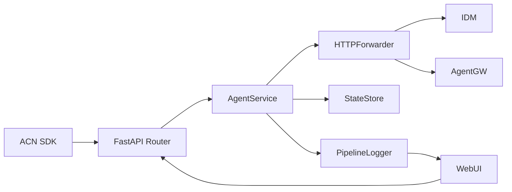
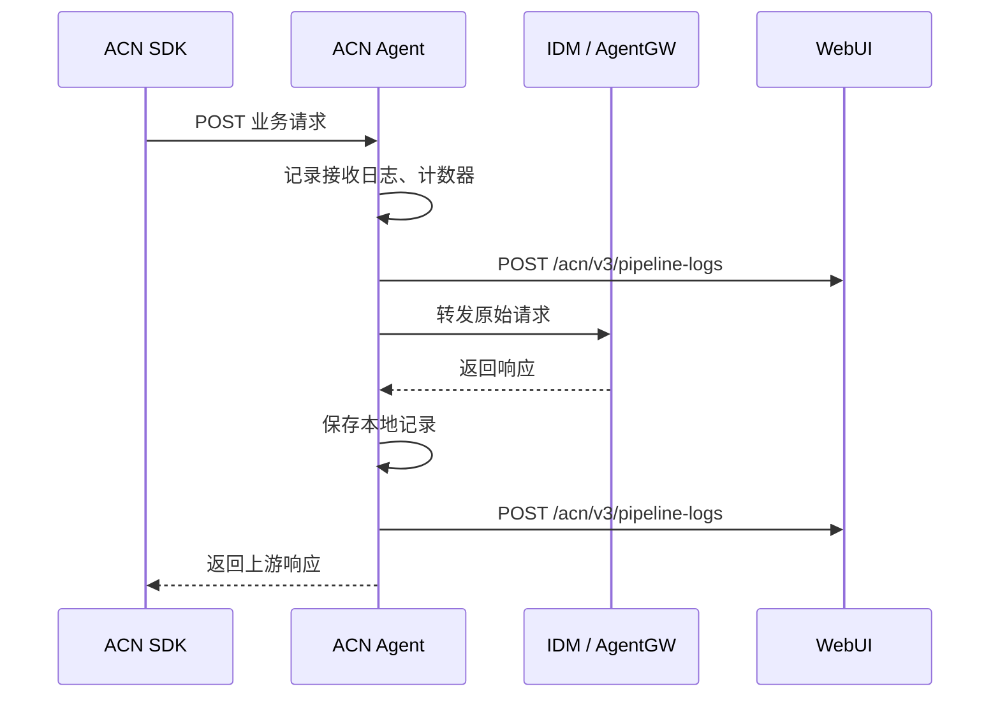

# ACN Agent 系统架构设计

## 1. 设计目标
- ACN Agent 作为协议适配与转发组件，对 ACN SDK 暴露统一入口 `9010`
- IDM、AgentGW、WebUI 地址在代码中定义，默认使用本机地址，端口固定
- 关键请求、响应、状态变更、流水日志均可追踪
- 模块化设计，便于后续增加消息类型或接入更多业务组件

## 2. 模块分层

## 3. 核心模块说明
- `acn_agent/api/routes.py`
  负责 HTTP 接口暴露、参数接收、异常转换。
- `acn_agent/services/agent_service.py`
  负责路由映射、转发编排、状态清理、关键日志和打点。
- `acn_agent/services/http_forwarder.py`
  负责上游 HTTP 通信封装，便于后续替换重试、鉴权、熔断能力。
- `acn_agent/services/pipeline_logger.py`
  负责流水日志本地保存，并按需上报给 WebUI。
- `acn_agent/services/state_store.py`
  负责本地内存状态保存，用于 clear 清理和调试追踪。
- `acn_agent/services/metrics.py`
  负责轻量级打点统计。

## 4. 请求时序

## 5. 状态管理
- 当前版本本地状态保存在内存中，满足 clear 清理场景和联调场景。
- 如果后续需要持久化，可将 `StateStore` 替换为 Redis / SQLite 等实现，不影响路由层。

## 6. 可扩展点
- 新增转发消息类型时，只需扩展 `AgentService.resolve_target`
- 可在 `HTTPForwarder` 中引入超时重试、签名透传、统一鉴权
- 可将 `MetricsRegistry` 替换为 Prometheus/OpenTelemetry
